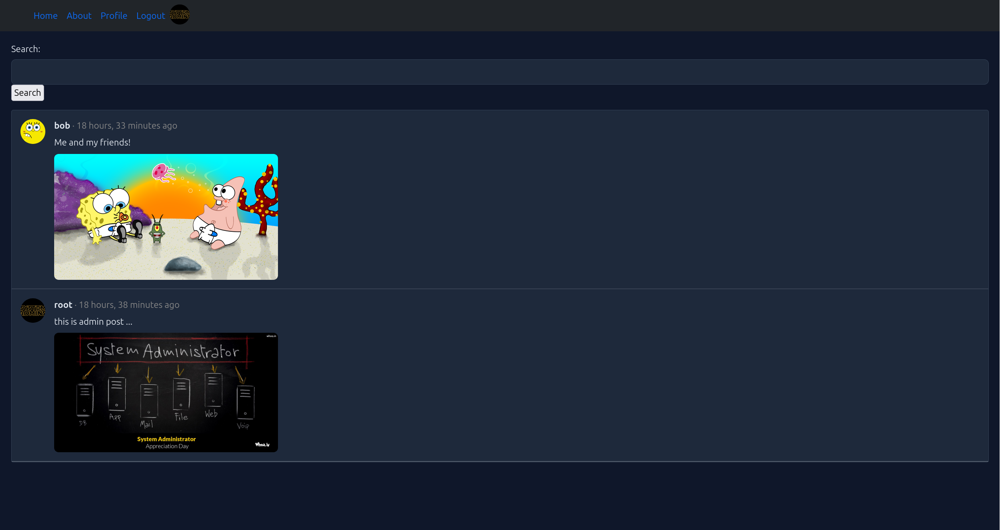
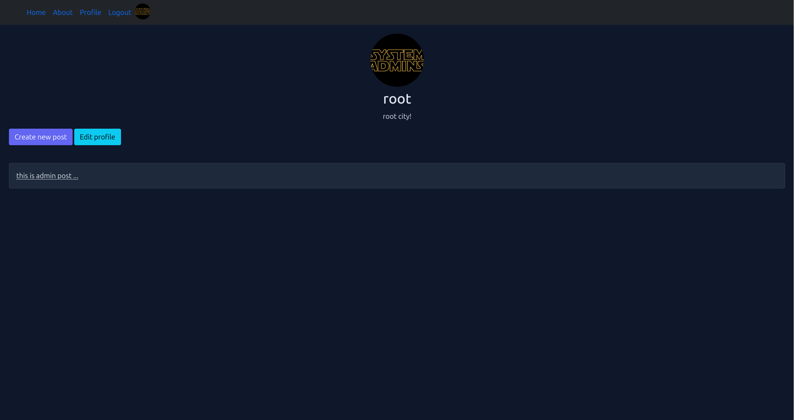
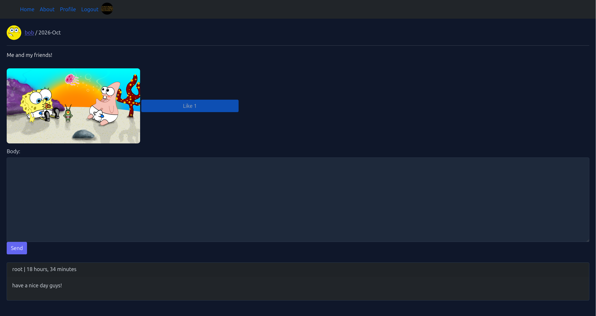

# 🌐 SocialNet — Django Social Network

A full-featured social network built with Django. Users can post (with images), like, comment, reply, follow each other, and search posts.



## ✨ Features

- 🔐 **Authentication** — Register/login with username **or email** (custom auth backend)
- 👤 **Profiles** — Avatar upload, age, address
- 📝 **Posts** — Create, update, delete with image upload
- ❤️ **Likes** — Duplicate-safe like system
- 💬 **Comments & Replies** — Nested comment threads
- 👥 **Follow system** — Follow/unfollow other users
- 🔍 **Search** — Search posts by content
- 🎨 **Dark theme UI** — Responsive design
- ⚠️ **Custom error pages** — 400, 403, 404, 405, 500

## 🛠 Tech Stack

- **Backend:** Django 6.1, Python 3.13
- **Database:** SQLite (dev-ready, PostgreSQL compatible)
- **Frontend:** Bootstrap 5, custom CSS
- **Media:** Pillow for image handling
- **Config:** python-decouple for env management

## 📸 Screenshots

| Home Feed | Profile |
|-----------|---------|
|  |  |

| Post Detail | Login |
|-------------|-------|
|  |  |

| Register | Create Post |
|----------|-------------|
|  |  |

## 🚀 Quick Start

### 1. Clone the repo

```bash
git clone https://github.com/yasinAmiri/django-social-network.git
cd social-network
